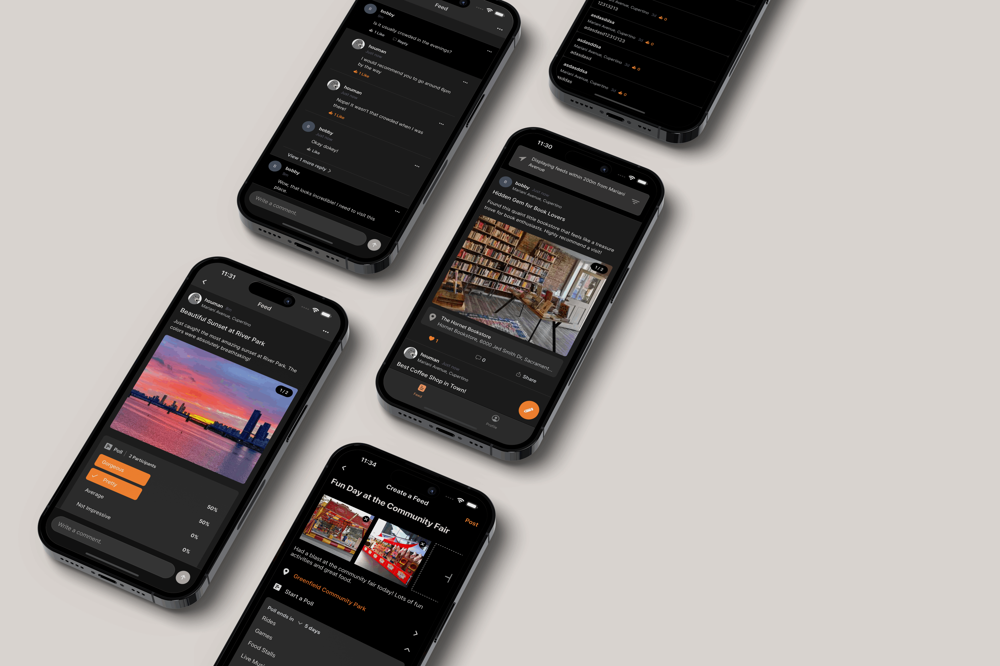
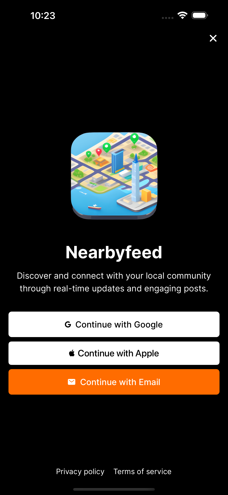

 
 <h1>NearbyFeed</h1>
 

  <b>Discover and connect with your local community</b>
 

  
  

NearbyFeed is an innovative app designed to reconnect communities by providing users with real-time updates and insights about their surroundings. By utilizing their current location, users can easily stay informed about local events, activities, and news. They can also create their own posts, share updates, and engage in conversations with other users through comments.

## Inspiration

The inspiration behind NearbyFeed stems from the need to address the problem of disconnected communities and decreased engagement in Singapore, particularly after the impact of Covid-19. This is a solution that would bring people together, foster community interaction, and revive neighborhood activity.

## Screenshots

**Home (Dark Mode)**            | **Home (Light Mode)**            | **Home**
:-------------------------:|:-------------------------:|:-------------------------:
  |    | 

**Onboarding**            | **Feed Details**            | **Add Feed**
:-------------------------:|:-------------------------:|:-------------------------:
  |   | 

**Comments**            | **Comments**            | **My Posts**
:-------------------------:|:-------------------------:|:-------------------------:
  |    | 

**My Comments**            | **Manage Account Linking**            | **Manage Blocked Accounts**
:-------------------------:|:-------------------------:|:-------------------------:
  |   | 

---

This section now displays the images in a three-column format.

## Built With

- [React Native](https://reactnative.dev/) - Framework for building cross-platform mobile apps
- [Expo](https://expo.io/) - Development platform for building React Native apps
- [NestJS](https://nestjs.com/) - Backend framework for building scalable server-side applications
- [Redis](https://redis.io/) - In-memory data store used for caching and session management
- [PostgreSQL](https://www.postgresql.org/) - Relational database management system used for data storage
- [Tailwind CSS](https://tailwindcss.com/) - Utility-first CSS framework used for styling the mobile frontend
- [Prisma](https://www.prisma.io/) - Database toolkit and ORM for building scalable and type-safe applications
- [TypeScript](https://www.typescriptlang.org/) - Typed superset of JavaScript used for improved developer productivity
- [Docker](https://www.docker.com/) - Containerization platform used for deploying and running applications in isolated environments

## Installation

Please refer to the [client](/client/README.md) folder and [server](/server/README.md) folder for the respective installation.

## License

This project is licensed under the MIT License - see the [LICENSE](LICENSE)
